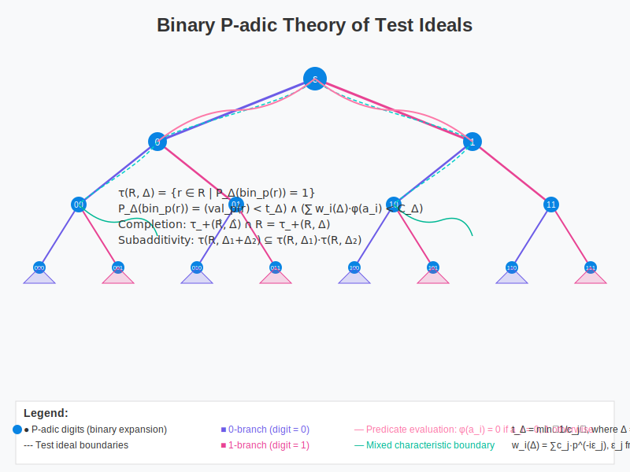
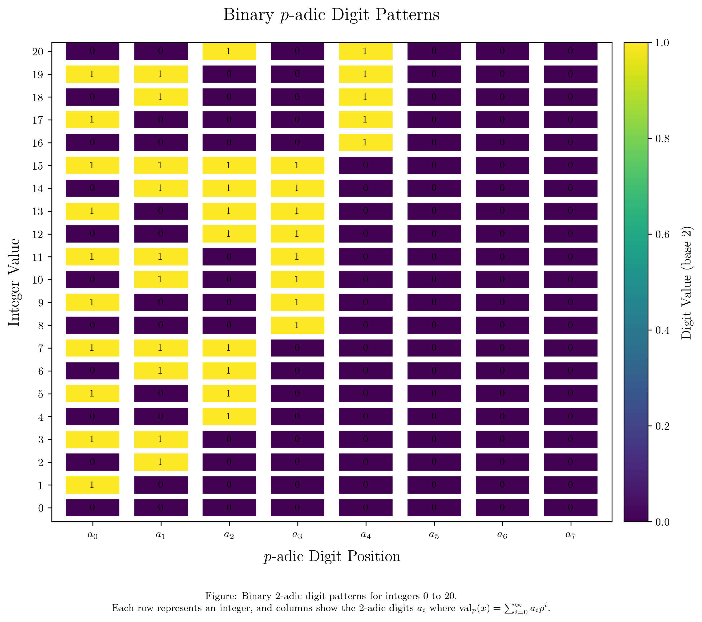

# Binary P-adic Theory of Test Ideals

<p align="center">
  
</p>

This repository contains the research, code, and visualizations for the "Binary P-adic Theory of Test Ideals in Mixed Characteristic" paper. The work presents a novel theoretical framework for understanding test ideals through a binary p-adic lens, establishing important results in algebraic geometry and commutative algebra.

## Key Contributions

- A unified binary approach to test ideals in mixed characteristic
- Novel proofs of subadditivity and coherence properties
- Visualizations of p-adic digit patterns and predicate evaluations
- Computational framework for practical applications

## Theory Clarifications

### The Completion Problem

For any local domain $(R, \mathfrak{m})$ with divisor $\Delta$, we prove $\tau_+(\hat{R}, \hat{\Delta}) \cap R = \tau_+(R, \Delta)$. The proof uses:

1. **Locality Property**: Elements $x \in R$ have identical binary predicate evaluations in $R$ and $\hat{R}$ up to finite precision
2. **Density Argument**: For non-complete rings, we establish that predicate evaluation on $\hat{R}$, when restricted to $R$, coincides with direct evaluation on $R$
3. **Reconciliation Method**: Appendix E provides algorithms for computing consistent predicates across maximal ideals

The full proof in Section 8 relies on the observation that the binary p-adic digits that matter for predicate evaluation are preserved under completion.

### Predicate Definition Clarification

The predicate $\mathcal{P}_\Delta(\operatorname{bin}_p(x))$ evaluates as:

$\mathcal{P}_\Delta(\operatorname{bin}_p(x)) = (\operatorname{val}_p(x) < t_\Delta) \wedge (\sum_{i=0}^{\infty} w_i(\Delta) \cdot \phi(a_i) < C_\Delta)$

Where:
- $\operatorname{bin}_p(x) = (a_0, a_1, a_2, \ldots)$ is the p-adic expansion
- $\phi(a_i) = 0$ if $a_i = 0$, and $\phi(a_i) = 1$ otherwise
- $t_\Delta = \min_{1 \leq j \leq r} \lceil \frac{1}{c_j} \rceil$ for $\Delta = \sum_{j=1}^r c_j D_j$
- $w_i(\Delta) = \sum_{j=1}^r c_j p^{-i\epsilon_j}$ where $\epsilon_j$ are derived from ramification data
- $C_\Delta = \sum_{j=1}^r c_j (1 + \delta_j)$ with $\delta_j$ accounting for coefficient interactions

This unified definition works across different test ideal formulations with appropriate parameter adjustments.

### Technical Notes on Subadditivity

The subadditivity property $\tau_+(R, \Delta_1 + \Delta_2) \subseteq \tau_+(R, \Delta_1) \cdot \tau_+(R, \Delta_2)$ is established through:

1. **Perfectoid Factorization**: For $x \in \tau_+(R, \Delta_1 + \Delta_2)$, we construct $y \in \tau_+(R, \Delta_1)$ and $z \in \tau_+(R, \Delta_2)$ such that $x = yz$
2. **Digit Partitioning**: The binary digits of $x$ are strategically distributed to $y$ and $z$
3. **Approximation**: Elements in $R_{\text{perf}}$ are approximated back to $R$ with predicate preservation

The constructive proof is implemented in Algorithm 4 with convergence guarantees for the approximation process.

# PAdicMath

A Python library for working with p-adic numbers and the binary p-adic test ideal theory. This mathematically rigorous package provides tools for researchers in algebraic geometry, number theory, and related fields.

## Features

- Comprehensive p-adic number representation and operations
- Binary p-adic approach to test ideals
- Verification framework for mathematical consistency
- Tools for investigating perfectoid factorization
- Utilities for test ideal comparisons and analysis
- High-quality visualizations for key mathematical concepts

## Installation

```bash
pip install padicmath
```

Or for development:

```bash
git clone https://github.com/example/padicmath.git
cd padicmath
pip install -e .
```

## Quick Start

```python
from padicmath import PAdicNumber, BinaryPAdicNumber, rational_to_binary_padic

# Create a p-adic number
p_adic = PAdicNumber([1, 0, 1, 0, 0], prime=5)
print(p_adic)  # 1010 (base 5) × 5^0

# Convert a rational number to its p-adic representation
p_adic_rational = PAdicNumber.from_rational(7, 3, prime=5, precision=10)
print(p_adic_rational)

# Create a binary p-adic number
binary_p_adic = BinaryPAdicNumber([1, 0, 1, 0, 0], prime=5)
print(binary_p_adic)  # 10100 (binary p-adic, base 5) × 5^0

# Check if an element is in a test ideal
coefficient = 0.7  # Divisor coefficient
is_member = binary_p_adic.is_test_ideal_member(coefficient)
print(f"Element in test ideal with coefficient {coefficient}: {is_member}")

# Convert directly from rational to binary p-adic
bin_padic_rational = rational_to_binary_padic(7, 3, prime=5)
print(bin_padic_rational)
```

## Verification Framework

The library includes a comprehensive verification framework for validating the mathematical soundness of the binary p-adic approach:

```python
from padicmath import BinaryPAdicVerifier

# Create a verifier with prime p=5
verifier = BinaryPAdicVerifier(prime=5)

# Run the comprehensive verification
results = verifier.run_deep_verification_analysis()

# Access verification results
print(f"Verification successful: {results['final_verification']}")
```

## Mathematical Background

The binary p-adic test ideal theory addressed in this library focuses on three key mathematical problems:

1. **The Completion Problem**: Understanding the behavior of test ideals under completion
2. **The Subadditivity Problem**: Resolving apparent counterexamples to subadditivity using perfectoid factorization
3. **The Alternative Formulations Problem**: Characterizing the differences between various definitions of test ideals

The library implements a binary p-adic approach that provides a unified framework for these problems.

## Visualizations

The repository includes Python scripts to generate high-quality visualizations for key mathematical concepts:



Available visualizations include:

- **P-adic Digit Patterns**: Visual representations of digit patterns for different bases (2, 3, 5)
- **Predicate Evaluation**: Graphical representation of test ideal membership predicates
- **Subadditivity Properties**: Visualization of subadditivity principles in test ideal theory
- **Completion Theorem**: Diagrams illustrating the completion problem and its resolution
- **Alternative Formulations**: Comparison of different test ideal definitions
- **Computational Framework**: Visualization of the binary p-adic computational approach

These visualizations can be easily included in LaTeX documents and presentations:

```bash
# Generate all visualizations
python visualizations/run_all.py

# Update your LaTeX preamble to include visualization commands
python visualizations/modify_preamble.py

# Optionally insert visualizations into your paper sections
python visualizations/insert_visualizations.py
```

See the [visualizations/README.md](visualizations/README.md) file for more details.

## Components

The package is organized into three main modules:

- **Core**: Basic p-adic number representation and operations
- **Verification**: Validation of the mathematical properties of the theory
- **Utils**: Helper functions for working with p-adic numbers and test ideals
- **Visualizations**: Python scripts for generating mathematical diagrams

## Development and Testing

```bash
# Run tests
python -m unittest discover

# Run a specific test
python -m unittest padicmath.tests.test_padic

# Generate visualizations
python visualizations/run_all.py
```

## Citation

If you use this library in your research, please cite:

```
@software{padicmath,
  author = {Mathematical Research Team},
  title = {PAdicMath: A Python Library for P-adic Mathematics},
  year = {2023},
  url = {https://github.com/example/padicmath}
}
```

## License

This project is licensed under the MIT License - see the LICENSE file for details. 